# DevContainers CI/CD Workflow Integration

## Overview

The devcontainers repository now uses a two-stage automated release system:

1. **Auto-Release Workflow** (`auto-release.yml`) - Triggers on main branch pushes
2. **Publish Workflow** (`publish.yml`) - Triggers on GitHub releases

## Workflow Flow

```mermaid
graph TD
    A[Push to main branch] --> B{Changes in features/<br/>templates/images?}
    B -->|Yes| C[auto-release.yml]
    B -->|No| D[No action]
    
    C --> E[Verify Changes<br/>- JSON validation<br/>- Structure checks<br/>- Feature tests]
    E -->|✅ Pass| F[Determine Version<br/>- Analyze commits<br/>- Check file changes<br/>- Calculate bump type]
    E -->|❌ Fail| G[Stop - No release]
    
    F --> H{Changes detected?}
    H -->|Yes| I[Create GitHub Release<br/>with auto-generated version]
    H -->|No| J[No release needed]
    
    I --> K[🚀 GitHub Release Created]
    K --> L[publish.yml triggered]
    
    L --> M[Sync Versions<br/>- Update all JSON files<br/>- Commit back to repo]
    M --> N[Run Tests]
    N --> O[Publish Features]
    O --> P[Publish Templates]
    P --> Q[Build Images<br/>- base<br/>- runner<br/>- settings-gen]
    Q --> R[Pre-build DevContainers]
    R --> S[✅ All Published]
```



## Version Bump Logic

The auto-release workflow determines version bumps based on:

### Major Version (X.0.0)
- Commit messages contain: `BREAKING`, `breaking change`, or `major`
- Changes to `devcontainer-feature.json` or `devcontainer-template.json` that modify core structure

### Minor Version (X.Y.0)  
- Commit messages contain: `feat`, `feature`, or `add`
- New files/directories in `features/src/` or `templates/`

### Patch Version (X.Y.Z)
- All other changes (bug fixes, documentation, minor updates)

## Workflow Files

### `auto-release.yml`
**Triggers**: Push to main branch with changes in relevant paths
**Purpose**: Create GitHub releases automatically
**Jobs**:
- `verify-changes`: Validate structure and run tests
- `determine-version`: Calculate next version number
- `create-release`: Create the GitHub release

### `publish.yml`  
**Triggers**: GitHub release published
**Purpose**: Build and publish all components
**Jobs**:
- `sync-versions`: Update all version numbers
- `test-features`: Run comprehensive tests
- `publish-*`: Build and publish components
- `prebuild`: Create pre-built images

## Benefits

✅ **Fully Automated**: No manual version management  
✅ **Verified Releases**: Tests run before any release  
✅ **Consistent Versioning**: All components stay in sync  
✅ **Smart Version Bumps**: Based on actual changes  
✅ **Comprehensive Publishing**: Features, templates, images, and pre-builds  
✅ **Audit Trail**: Clear changelog and release notes  

## Usage

Simply push your changes to the main branch:

```bash
git add .
git commit -m "feat: add new kubernetes feature"
git push origin main
```

The system will:
1. Detect this is a new feature (minor version bump)
2. Create a release (e.g., v1.5.0)
3. Update all component versions to 1.5.0
4. Publish everything to the registry