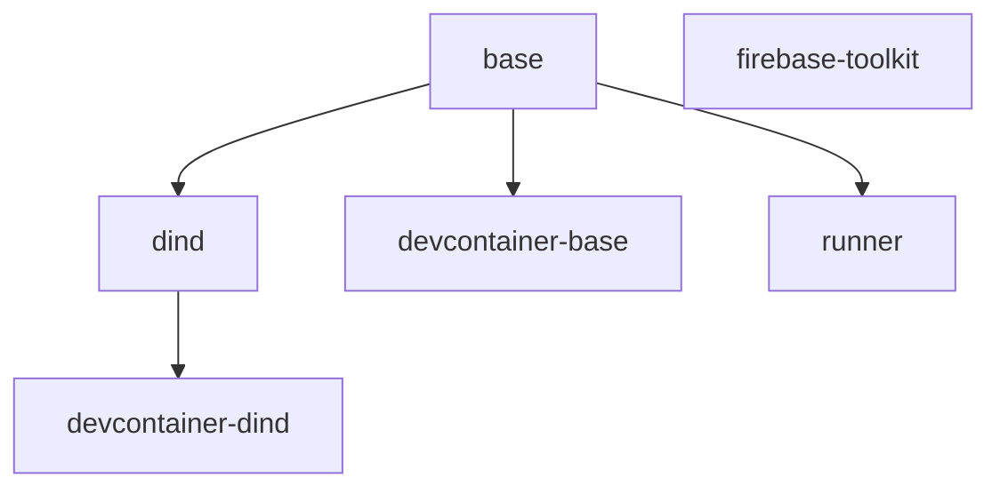

# OneZero DevContainers

A comprehensive collection of development containers, features, and templates that use [mise](https://mise.jdx.dev/) for managing programming languages and development tools.

## 📋 Table of Contents

- [Overview](#overview)
- [Quick Start](#quick-start)
- [DevContainer Templates](#devcontainer-templates)
- [Docker Images](#docker-images)
- [DevContainer Features](#devcontainer-features)
- [Tool Management with mise](#tool-management-with-mise)
- [Usage Examples](#usage-examples)
- [Architecture](#architecture)
- [Contributing](#contributing)
- [License](#license)

## 🎯 Overview

This repository provides:

1. **DevContainer Templates** - Pre-configured development environments (OneZero and OneZero-DIND)
2. **Docker Images** - Base images for various development scenarios
3. **DevContainer Features** - Modular components for installing and configuring development tools
4. **Tool Management** - Unified tool version management using mise

## 🚀 Quick Start

### Option 1: Use a DevContainer Template (Recommended)

The easiest way to get started is using our pre-configured templates:

#### Using VS Code Command Palette

1. Open VS Code
2. Press `F1` and run "Dev Containers: Add Dev Container Configuration Files..."
3. Select "Add configuration to workspace"
4. Search for "onezerocompany"
5. Choose either:
   - **OneZero Unified Devcontainer** - Standard development environment
   - **OneZero DIND Devcontainer** - With Docker-in-Docker support

#### Using GitHub Codespaces

1. Create a new repository or open an existing one
2. Click the green "Code" button → "Codespaces" tab
3. Click the gear icon → "New with options..."
4. Under "Dev container configuration", search for "onezerocompany"
5. Select your preferred template

### Option 2: Manual Configuration

Create a `.devcontainer/devcontainer.json` file in your project:

```json
{
  "name": "My Dev Environment",
  "image": "ghcr.io/onezerocompany/devcontainer-base",
  "features": {
    "ghcr.io/onezerocompany/devcontainers/features/mise:1": {
      "version": "latest",
      "enableMiseTrust": true
    },
    "ghcr.io/onezerocompany/devcontainers/features/common-utils:2.0.0": {}
  },
  "remoteUser": "zero",
  "postCreateCommand": "mise install"
}
```

## 📦 DevContainer Templates

### OneZero Unified Devcontainer

A comprehensive development container with mise for managing all your tools.

**Template ID:** `ghcr.io/onezerocompany/devcontainer/onezero`

**Features:**
- mise for polyglot tool management
- Common shell utilities (zoxide, eza, bat, starship)
- Pre-configured with essential development tools
- Support for multiple programming languages

**Usage:**
```bash
# Install template using devcontainer CLI
devcontainer templates apply -t ghcr.io/onezerocompany/devcontainer/onezero
```

### OneZero DIND Devcontainer

Development container with Docker-in-Docker support for container development workflows.

**Template ID:** `ghcr.io/onezerocompany/devcontainer/onezero-dind`

**Features:**
- Everything from OneZero Unified
- Docker-in-Docker support
- Docker Compose
- Container development tools

**Usage:**
```bash
# Install template using devcontainer CLI
devcontainer templates apply -t ghcr.io/onezerocompany/devcontainer/onezero-dind
```

## 🐳 Docker Images

All images support both `linux/amd64` and `linux/arm64` architectures.

### Base Images

#### `ghcr.io/onezerocompany/base`
- Foundation Ubuntu image
- Minimal setup with essential system packages
- User "zero" with sudo access
- Clean base for other images

#### `ghcr.io/onezerocompany/dind`
- Extends base image
- Docker-in-Docker capability
- Docker Compose included
- Ideal for container development

#### `ghcr.io/onezerocompany/devcontainer-base`
- Primary devcontainer image
- Extends base image
- Includes development essentials
- Ready for mise and features

#### `ghcr.io/onezerocompany/devcontainer-dind`
- DevContainer with Docker support
- Extends dind image
- Full container development environment

### Specialized Images

#### `ghcr.io/onezerocompany/runner`
- GitHub Actions self-hosted runner
- Pre-configured with runner dependencies
- Auto-updates runner version

#### `ghcr.io/onezerocompany/firebase-toolkit`
- Standalone Firebase development tools
- Firebase CLI and emulators
- Node.js LTS included

## 🔧 DevContainer Features

Features are modular components that can be added to any devcontainer.

### Core Features

#### mise (`ghcr.io/onezerocompany/devcontainers/features/mise`)

Polyglot runtime manager for all your development tools.

**Options:**
- `version` - mise version to install (default: "latest")
- `enableMiseTrust` - Auto-trust .mise.toml files (default: false)

**Example:**
```json
"features": {
  "ghcr.io/onezerocompany/devcontainers/features/mise:1": {
    "version": "latest",
    "enableMiseTrust": true
  }
}
```

#### common-utils (`ghcr.io/onezerocompany/devcontainers/features/common-utils`)

Essential shell utilities and productivity tools.

**Includes:**
- **zoxide** - Smarter cd command
- **eza** - Modern ls replacement
- **bat** - cat with syntax highlighting
- **starship** - Cross-shell prompt
- **fd** - Fast file finder
- **ripgrep** - Fast grep
- **fzf** - Fuzzy finder
- **delta** - Better git diffs
- **duf** - Disk usage utility
- **ncdu** - NCurses disk usage
- **procs** - Modern ps
- **broot** - File explorer
- **yq** - YAML processor
- **httpie** - HTTP client
- **lazygit** - Git UI
- **tmux** - Terminal multiplexer

**Example:**
```json
"features": {
  "ghcr.io/onezerocompany/devcontainers/features/common-utils:2.0.0": {}
}
```

### Special Purpose Features

#### docker (`ghcr.io/onezerocompany/devcontainers/features/docker`)

Docker-in-Docker support for container development.

**Options:**
- `version` - Docker version
- `dockerDashComposeVersion` - Docker Compose version

#### sandbox (`ghcr.io/onezerocompany/devcontainers/features/sandbox`)

Claude Code CLI with sandboxed environment.

**Options:**
- `enableFirewall` - Enable firewall rules (default: true)
- `allowedDomains` - Comma-separated list of allowed domains

**Example:**
```json
"features": {
  "ghcr.io/onezerocompany/devcontainers/features/sandbox:1": {
    "enableFirewall": true,
    "allowedDomains": "api.github.com,registry.npmjs.org"
  }
}
```

## 🛠️ Tool Management with mise

Instead of installing fixed tool versions through features, we use [mise](https://mise.jdx.dev/) for flexible version management.

### Benefits

- **Version Flexibility** - Switch versions without rebuilding containers
- **Project Isolation** - Each project can specify its own versions
- **Fast Installation** - Tools are cached and reused
- **Wide Support** - Hundreds of tools available

### Configuration

Create a `.mise.toml` file in your project root:

```toml
[tools]
# Programming Languages
node = "lts"              # Latest LTS Node.js
python = "3.12"           # Specific Python version
go = "latest"             # Latest Go
rust = "stable"           # Stable Rust
ruby = "3.3"              # Ruby 3.3
java = "openjdk-21"       # OpenJDK 21

# JavaScript Tools
bun = "latest"            # Bun runtime
deno = "latest"           # Deno runtime
pnpm = "latest"           # pnpm package manager
yarn = "latest"           # Yarn package manager

# Cloud Tools
aws-cli = "latest"        # AWS CLI
gcloud = "latest"         # Google Cloud CLI
azure-cli = "latest"      # Azure CLI
kubectl = "latest"        # Kubernetes CLI
helm = "latest"           # Helm
terraform = "latest"      # Terraform

# Development Tools
github-cli = "latest"     # GitHub CLI
firebase = "latest"       # Firebase CLI
trivy = "latest"          # Security scanner
1password-cli = "latest"  # 1Password CLI
hugo = "latest"           # Static site generator

# Database Tools
postgresql = "16"         # PostgreSQL client
mysql = "8.0"             # MySQL client
redis = "latest"          # Redis
mongodb = "latest"        # MongoDB

[settings]
experimental = true
trusted_config_paths = ["/workspaces"]
```

### Common Commands

```bash
# Install all tools defined in .mise.toml
mise install

# Install a specific tool
mise install node@20

# Use a tool temporarily
mise use python@3.11

# List installed tools
mise list

# Update all tools
mise upgrade

# See all available tools
mise plugins list
```

## 📚 Usage Examples

### Example 1: Node.js Development

`.devcontainer/devcontainer.json`:
```json
{
  "name": "Node.js Project",
  "image": "ghcr.io/onezerocompany/devcontainer-base",
  "features": {
    "ghcr.io/onezerocompany/devcontainers/features/mise:1": {
      "enableMiseTrust": true
    },
    "ghcr.io/onezerocompany/devcontainers/features/common-utils:2.0.0": {}
  },
  "remoteUser": "zero",
  "postCreateCommand": "mise install && npm install"
}
```

`.mise.toml`:
```toml
[tools]
node = "20"
pnpm = "latest"
```

### Example 2: Python Data Science

`.devcontainer/devcontainer.json`:
```json
{
  "name": "Python Data Science",
  "image": "ghcr.io/onezerocompany/devcontainer-base",
  "features": {
    "ghcr.io/onezerocompany/devcontainers/features/mise:1": {
      "enableMiseTrust": true
    },
    "ghcr.io/onezerocompany/devcontainers/features/common-utils:2.0.0": {}
  },
  "remoteUser": "zero",
  "postCreateCommand": "mise install && pip install -r requirements.txt",
  "customizations": {
    "vscode": {
      "extensions": [
        "ms-python.python",
        "ms-toolsai.jupyter"
      ]
    }
  }
}
```

`.mise.toml`:
```toml
[tools]
python = "3.12"
poetry = "latest"
ruff = "latest"
```

### Example 3: Full-Stack with Docker

`.devcontainer/devcontainer.json`:
```json
{
  "name": "Full-Stack Development",
  "image": "ghcr.io/onezerocompany/devcontainer-dind",
  "features": {
    "ghcr.io/onezerocompany/devcontainers/features/mise:1": {
      "enableMiseTrust": true
    },
    "ghcr.io/onezerocompany/devcontainers/features/common-utils:2.0.0": {},
    "ghcr.io/onezerocompany/devcontainers/features/docker:1": {}
  },
  "remoteUser": "zero",
  "postCreateCommand": "mise install",
  "mounts": [
    "source=/var/run/docker.sock,target=/var/run/docker.sock,type=bind"
  ]
}
```

`.mise.toml`:
```toml
[tools]
node = "lts"
python = "3.12"
go = "latest"
kubectl = "latest"
docker-compose = "latest"
```

### Example 4: Claude Code Development

`.devcontainer/devcontainer.json`:
```json
{
  "name": "Claude Code Development",
  "image": "ghcr.io/onezerocompany/devcontainer-base",
  "features": {
    "ghcr.io/onezerocompany/devcontainers/features/mise:1": {
      "enableMiseTrust": true
    },
    "ghcr.io/onezerocompany/devcontainers/features/common-utils:2.0.0": {},
    "ghcr.io/onezerocompany/devcontainers/features/sandbox:1": {
      "enableFirewall": true
    }
  },
  "remoteUser": "zero",
  "postCreateCommand": "mise install"
}
```

## 🏗️ Architecture

### Repository Structure

```
.
├── .github/workflows/
│   ├── pr-validation.yml    # PR checks and tests
│   └── publish.yml          # Build and publish pipeline
├── devcontainers/           # Pre-configured templates
│   ├── onezero/            # Standard template
│   └── onezero-dind/       # Docker-in-Docker template
├── features/               # DevContainer features
│   ├── src/               # Feature definitions
│   └── test/              # Feature tests
└── images/                # Docker images
    ├── base/              # Foundation image
    ├── dind/              # Docker-in-Docker
    ├── devcontainer-base/ # Main devcontainer
    ├── devcontainer-dind/ # DevContainer with Docker
    ├── runner/            # GitHub Actions runner
    └── firebase-toolkit/  # Firebase tools
```

### Build Dependencies



### Publishing

All components are automatically published via GitHub Actions:
- **Trigger**: Push to main, daily at 3 AM UTC, or manual
- **Images**: Published to `ghcr.io/onezerocompany/[image-name]`
- **Features**: Published to `onezerocompany/devcontainers/features`
- **Templates**: Published to `onezerocompany/devcontainer`

## 🤝 Contributing

We welcome contributions! Please see [CONTRIBUTING.md](CONTRIBUTING.md) for guidelines.

### Development Workflow

1. Fork the repository
2. Create a feature branch
3. Make your changes
4. Test locally:
   ```bash
   # Test features
   cd features/test/[feature-name]
   ./test.sh
   
   # Build images
   docker build -t test-image ./images/[image-name]
   ```
5. Submit a pull request

### Testing Features

Features use the `dev-container-features-test-lib` for testing:

```bash
# Run all tests
cd features/test
for dir in */; do
  cd "$dir" && ./test.sh && cd ..
done
```

## 📄 License

This project is licensed under the MIT License - see the [LICENSE](LICENSE) file for details.

## 🙏 Acknowledgments

- [mise](https://mise.jdx.dev/) for excellent tool management
- [DevContainers](https://containers.dev/) for the specification
- All the amazing open source tools included in our features

## 📞 Support

- **Issues**: [GitHub Issues](https://github.com/onezerocompany/devcontainers/issues)
- **Discussions**: [GitHub Discussions](https://github.com/onezerocompany/devcontainers/discussions)
- **Security**: See [SECURITY.md](SECURITY.md)