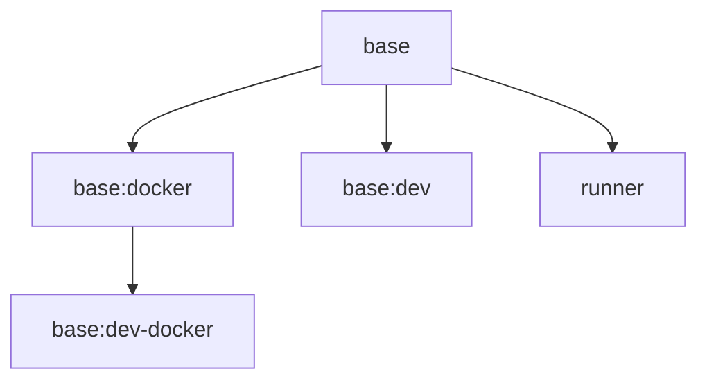

# DevContainers

A comprehensive collection of development containers, features, and templates that use [mise](https://mise.jdx.dev/) for managing programming languages and development tools.

## 📋 Table of Contents

- [Overview](#overview)
- [Quick Start](#quick-start)
- [DevContainer Templates](#devcontainer-templates)
- [Docker Images](#docker-images)
- [DevContainer Features](#devcontainer-features)
- [Tool Management with mise](#tool-management-with-mise)
- [Usage Examples](#usage-examples)
- [Architecture](#architecture)
- [Contributing](#contributing)
- [License](#license)

## 🎯 Overview

This repository provides:

1. **DevContainer Templates** - Pre-configured development environments (dev and dev:docker)
2. **Docker Images** - Base images for various development scenarios
3. **DevContainer Features** - Modular components for installing and configuring development tools
4. **Tool Management** - Unified tool version management using mise

## 🚀 Quick Start

### Option 1: Use DevContainer CLI (Recommended)

Since our templates are published to GitHub Container Registry (not the Microsoft marketplace), use the DevContainer CLI to apply them:

```bash
# Install the DevContainer CLI if you haven't already
npm install -g @devcontainers/cli

# Apply the standard template
devcontainer templates apply -t ghcr.io/onezerocompany/dev

# OR apply the Docker-in-Docker template
devcontainer templates apply -t ghcr.io/onezerocompany/dev-docker
```

### Option 2: Copy Template Configuration

You can directly copy the template configuration to your project:

1. Create a `.devcontainer` directory in your project root
2. Copy the template's `devcontainer.json` from this repository:
   - For standard: `/devcontainers/dev/.devcontainer.json`
   - For DIND: `/devcontainers/dev-docker/.devcontainer.json`
3. (Optional) Copy the `.mise.toml` file for tool configuration

### Option 3: Manual Configuration

Create a `.devcontainer/devcontainer.json` file in your project:

```json
{
  "name": "My Dev Environment",
  "image": "ghcr.io/onezerocompany/base:dev",
  "features": {
    "ghcr.io/onezerocompany/devcontainers/features/mise:1": {
      "version": "latest",
      "enableMiseTrust": true
    }
  },
  "remoteUser": "zero",
  "postCreateCommand": "mise install"
}
```

## 📦 DevContainer Templates

Our templates are published to GitHub Container Registry under the namespace `onezerocompany`. They're not available in the VS Code template picker, but can be used through the DevContainer CLI or manual configuration.

### Template Publishing Details

- **Registry**: GitHub Container Registry (`ghcr.io`)
- **Namespace**: `onezerocompany`
- **Publishing**: Automated via GitHub Actions (on push to main and daily at 3 AM UTC)

### Dev

A comprehensive development container with mise for managing all your tools.

**Template ID:** `ghcr.io/onezerocompany/dev`

**Features:**
- mise for polyglot tool management
- Common shell utilities (zoxide, eza, bat, starship)
- Pre-configured with Node.js, Bun, and GitHub CLI
- Support for adding any programming language or tool via mise
- VS Code extensions: EditorConfig, GitLens, GitHub Pull Requests, Docker, Makefile Tools

**Usage Methods:**

1. **DevContainer CLI:**
   ```bash
   devcontainer templates apply -t ghcr.io/onezerocompany/dev
   ```

2. **Direct Configuration:**
   ```json
   {
     "name": "Dev Container",
     "image": "ghcr.io/onezerocompany/base:dev",
     "features": {
       "ghcr.io/onezerocompany/devcontainers/features/mise:1": {
         "version": "latest",
         "enableMiseTrust": true
       }
     },
     "containerEnv": {
       "DEVCONTAINER_SANDBOX_ENABLED": "true",
       "DEVCONTAINER_SANDBOX_FIREWALL": "true"
     },
     "capAdd": ["NET_ADMIN"],
     "remoteUser": "zero",
     "postCreateCommand": "mise install"
   }
   ```

### Dev-Docker

Development container with Docker-in-Docker support for container development workflows.

**Template ID:** `ghcr.io/onezerocompany/dev-docker`

**Features:**
- Everything from Dev template
- Docker-in-Docker support
- Docker Compose
- Container development tools

**Usage Methods:**

1. **DevContainer CLI:**
   ```bash
   devcontainer templates apply -t ghcr.io/onezerocompany/dev-docker
   ```

2. **Direct Configuration:**
   ```json
   {
     "name": "Dev:Docker",
     "image": "ghcr.io/onezerocompany/base:dev-docker",
     "features": {
       "ghcr.io/onezerocompany/devcontainers/features/mise:1": {
         "version": "latest",
         "enableMiseTrust": true
       }
     },
     "containerEnv": {
       "DEVCONTAINER_SANDBOX_ENABLED": "true",
       "DEVCONTAINER_SANDBOX_FIREWALL": "true"
     },
     "capAdd": ["NET_ADMIN"],
     "remoteUser": "zero",
     "postCreateCommand": "mise install",
     "runArgs": ["--privileged"],
     "overrideCommand": false
   }
   ```

### Alternative Usage Patterns

Since these templates aren't in Microsoft's marketplace, users typically:

1. **Use Published Docker Images Directly**: Reference our pre-built images with your own feature combinations
2. **Fork and Customize**: Fork this repository to create your own customized templates
3. **Reference Features Individually**: Pick and choose specific features in your devcontainer configuration
4. **CI/CD Integration**: Use the DevContainer CLI to programmatically apply templates in automated workflows

### Programmatic Template Usage

The DevContainer CLI enables powerful automation scenarios:

```bash
# Apply template to a new project
mkdir my-new-project && cd my-new-project
devcontainer templates apply -t ghcr.io/onezerocompany/dev

# Use in CI/CD pipeline
- name: Setup DevContainer
  run: |
    npm install -g @devcontainers/cli
    devcontainer templates apply -t ghcr.io/onezerocompany/dev --workspace-folder .
    
# Build and run devcontainer in CI
- name: Build DevContainer
  run: devcontainer build --workspace-folder .

- name: Run Tests in DevContainer
  run: devcontainer exec --workspace-folder . npm test
```

### GitHub Codespaces Configuration

While the templates aren't searchable in the Codespaces UI, you can still use them by creating a `.devcontainer/devcontainer.json` file in your repository that references our images and features:

```json
{
  "name": "My Codespace",
  "image": "ghcr.io/onezerocompany/base:dev",
  "features": {
    "ghcr.io/onezerocompany/devcontainers/features/mise:1": {}
  }
}
```

## 🐳 Docker Images

All images support both `linux/amd64` and `linux/arm64` architectures.

### Base Images

#### `ghcr.io/onezerocompany/base`
- Foundation Ubuntu image
- Minimal setup with essential system packages
- User "zero" with sudo access
- Clean base for other images

#### `ghcr.io/onezerocompany/base:docker`
- Extends base image
- Docker-in-Docker capability
- Docker Compose included
- Ideal for container development

#### `ghcr.io/onezerocompany/base:dev`
- Primary devcontainer image
- Extends base image
- Includes development essentials
- Ready for mise and features

#### `ghcr.io/onezerocompany/base:dev-docker`
- DevContainer with Docker support
- Extends base:docker image
- Full container development environment

### Specialized Images

#### `ghcr.io/onezerocompany/runner`
- GitHub Actions self-hosted runner
- Pre-configured with runner dependencies
- Auto-updates runner version


## 🔧 DevContainer Features

Features are modular components that can be added to any devcontainer.

### Core Features

#### mise (`ghcr.io/onezerocompany/devcontainers/features/mise`)

Polyglot runtime manager for all your development tools.

**Options:**
- `version` - mise version to install (default: "latest")
- `enableMiseTrust` - Auto-trust .mise.toml files (default: false)

**Example:**
```json
"features": {
  "ghcr.io/onezerocompany/devcontainers/features/mise:1": {
    "version": "latest",
    "enableMiseTrust": true
  }
}
```


### Special Purpose Features

#### docker (Integrated into dind devcontainer)

Docker-in-Docker support is now integrated directly into the `devcontainer:dind` image. Use the dind devcontainer image for Docker support instead of the standalone feature.

**Note:** The docker feature (`ghcr.io/onezerocompany/devcontainers/features/docker`) has been deprecated and integrated into the dind devcontainer image.

#### sandbox (Integrated into base devcontainer)

Sandbox functionality is now integrated directly into the `devcontainer:base` image and can be enabled/disabled at runtime without rebuilding the image.

**Note:** The sandbox feature (`ghcr.io/onezerocompany/devcontainers/features/sandbox`) has been deprecated and integrated into the base devcontainer image.

**Runtime Configuration:**
```json
{
  "image": "ghcr.io/onezerocompany/devcontainer:base",
  "containerEnv": {
    "DEVCONTAINER_SANDBOX_ENABLED": "true",
    "DEVCONTAINER_SANDBOX_FIREWALL": "true",
    "DEVCONTAINER_SANDBOX_ALLOWED_DOMAINS": "example.com,myapi.com"
  },
  "capAdd": ["NET_ADMIN"]
}
```

**Security:** The sandbox configuration is immutable from inside the container - it can only be set at container creation time.

## 🛠️ Tool Management with mise

Instead of installing fixed tool versions through features, we use [mise](https://mise.jdx.dev/) for flexible version management.

### Benefits

- **Version Flexibility** - Switch versions without rebuilding containers
- **Project Isolation** - Each project can specify its own versions
- **Fast Installation** - Tools are cached and reused
- **Wide Support** - Hundreds of tools available

### Configuration

The templates come with minimal tools pre-configured (Node.js, Bun, GitHub CLI). You can add any tools you need by creating a `.mise.toml` file in your project root.

**Example `.mise.toml` showing available tools:**

```toml
[tools]
# Programming Languages
node = "lts"              # Latest LTS Node.js
python = "3.12"           # Specific Python version
go = "latest"             # Latest Go
rust = "stable"           # Stable Rust
ruby = "3.3"              # Ruby 3.3
java = "openjdk-21"       # OpenJDK 21

# JavaScript Tools
bun = "latest"            # Bun runtime
deno = "latest"           # Deno runtime
pnpm = "latest"           # pnpm package manager
yarn = "latest"           # Yarn package manager

# Cloud Tools
aws-cli = "latest"        # AWS CLI
gcloud = "latest"         # Google Cloud CLI
azure-cli = "latest"      # Azure CLI
kubectl = "latest"        # Kubernetes CLI
helm = "latest"           # Helm
terraform = "latest"      # Terraform

# Development Tools
github-cli = "latest"     # GitHub CLI
firebase = "latest"       # Firebase CLI
trivy = "latest"          # Security scanner
1password-cli = "latest"  # 1Password CLI
hugo = "latest"           # Static site generator

# Database Tools
postgresql = "16"         # PostgreSQL client
mysql = "8.0"             # MySQL client
redis = "latest"          # Redis
mongodb = "latest"        # MongoDB

[settings]
experimental = true
trusted_config_paths = ["/workspaces"]
```

### Common Commands

```bash
# Install all tools defined in .mise.toml
mise install

# Install a specific tool
mise install node@20

# Use a tool temporarily
mise use python@3.11

# List installed tools
mise list

# Update all tools
mise upgrade

# See all available tools
mise plugins list
```

## 📚 Usage Examples

### Example 1: Node.js Development

`.devcontainer/devcontainer.json`:
```json
{
  "name": "Node.js Project",
  "image": "ghcr.io/onezerocompany/base:dev",
  "features": {
    "ghcr.io/onezerocompany/devcontainers/features/mise:1": {
      "enableMiseTrust": true
    }
  },
  "remoteUser": "zero",
  "postCreateCommand": "mise install && npm install"
}
```

`.mise.toml`:
```toml
[tools]
node = "20"
pnpm = "latest"
```

### Example 2: Python Data Science

`.devcontainer/devcontainer.json`:
```json
{
  "name": "Python Data Science",
  "image": "ghcr.io/onezerocompany/base:dev",
  "features": {
    "ghcr.io/onezerocompany/devcontainers/features/mise:1": {
      "enableMiseTrust": true
    }
  },
  "remoteUser": "zero",
  "postCreateCommand": "mise install && pip install -r requirements.txt",
  "customizations": {
    "vscode": {
      "extensions": [
        "ms-python.python",
        "ms-toolsai.jupyter"
      ]
    }
  }
}
```

`.mise.toml`:
```toml
[tools]
python = "3.12"
poetry = "latest"
ruff = "latest"
```

### Example 3: Full-Stack with Docker

`.devcontainer/devcontainer.json`:
```json
{
  "name": "Full-Stack Development",
  "image": "ghcr.io/onezerocompany/devcontainer:dind",
  "features": {
    "ghcr.io/onezerocompany/devcontainers/features/mise:1": {
      "enableMiseTrust": true
    }
  },
  "remoteUser": "zero",
  "postCreateCommand": "mise install",
  "mounts": [
    "source=/var/run/docker.sock,target=/var/run/docker.sock,type=bind"
  ]
}
```

`.mise.toml`:
```toml
[tools]
node = "lts"
python = "3.12"
go = "latest"
kubectl = "latest"
docker-compose = "latest"
```

### Example 4: Claude Code Development

`.devcontainer/devcontainer.json`:
```json
{
  "name": "Claude Code Development",
  "image": "ghcr.io/onezerocompany/base:dev",
  "features": {
    "ghcr.io/onezerocompany/devcontainers/features/mise:1": {
      "enableMiseTrust": true
    }
  },
  "containerEnv": {
    "DEVCONTAINER_SANDBOX_ENABLED": "true",
    "DEVCONTAINER_SANDBOX_FIREWALL": "true"
  },
  "capAdd": ["NET_ADMIN"],
  "remoteUser": "zero",
  "postCreateCommand": "mise install"
}
```

## 🏗️ Architecture

### Repository Structure

```
.
├── .github/workflows/
│   ├── pr-validation.yml    # PR checks and tests
│   └── publish.yml          # Build and publish pipeline
├── devcontainers/           # Pre-configured templates
│   ├── dev/                # Standard template
│   └── dev-docker/         # Docker-in-Docker template
├── features/               # DevContainer features
│   ├── src/               # Feature definitions
│   └── test/              # Feature tests
└── images/                # Docker images
    ├── base/              # Foundation image
    ├── base-docker/       # Docker-in-Docker
    ├── base-dev/          # Main devcontainer
    ├── base-dev-docker/   # DevContainer with Docker
    └── runner/            # GitHub Actions runner
```

### Build Dependencies



### Publishing

All components are automatically published via GitHub Actions:
- **Trigger**: Push to main, daily at 3 AM UTC, or manual
- **Images**: Published to `ghcr.io/onezerocompany/[image-name]`
- **Features**: Published to `onezerocompany/devcontainers/features`
- **Templates**: Published as `ghcr.io/onezerocompany/dev` and `ghcr.io/onezerocompany/dev-docker`

## 🤝 Contributing

We welcome contributions! Please see [CONTRIBUTING.md](CONTRIBUTING.md) for guidelines.

### Development Workflow

1. Fork the repository
2. Create a feature branch
3. Make your changes
4. Test locally:
   ```bash
   # Test features
   cd features/test/[feature-name]
   ./test.sh
   
   # Build images
   docker build -t test-image ./images/[image-name]
   ```
5. Submit a pull request

### Testing Features

Features use the `dev-container-features-test-lib` for testing:

```bash
# Run all tests
cd features/test
for dir in */; do
  cd "$dir" && ./test.sh && cd ..
done
```

## 📄 License

This project is licensed under the MIT License - see the [LICENSE](LICENSE) file for details.

## 🙏 Acknowledgments

- [mise](https://mise.jdx.dev/) for excellent tool management
- [DevContainers](https://containers.dev/) for the specification
- All the amazing open source tools included in our features

## 📞 Support

- **Issues**: [GitHub Issues](https://github.com/onezerocompany/devcontainers/issues)
- **Discussions**: [GitHub Discussions](https://github.com/onezerocompany/devcontainers/discussions)
- **Security**: See [SECURITY.md](SECURITY.md)